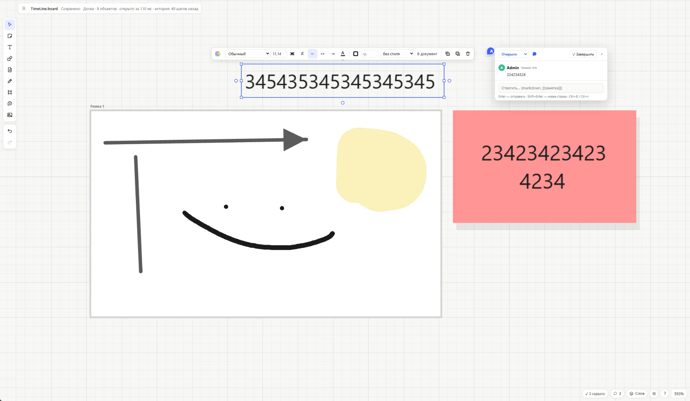

# vaultboard

Бесконечная доска в духе Miro, которая хранит всё обычными файлами у тебя на диске. Стикеры, фигуры, стрелки, рисование, фото без сжатия, карточки ссылок и видео, комментарии, слои — и markdown-заметки, которые открываются и правятся прямо на доске. С Obsidian дружит: можно указать его хранилище, и заметки на досках будут те же, что в Obsidian. Без Obsidian тоже работает.

*An open-source, local-first Miro-like whiteboard. Boards, notes and photos are plain files in a folder you choose. The interface is in Russian.*



## Быстрый старт (Windows)

1. Скачай готовую сборку: **[vaultboard.zip](https://github.com/jestxfot/vaultboard/releases/latest/download/vaultboard.zip)** (всегда последняя версия).
2. Распакуй его в любую папку.
3. Дважды щёлкни `vaultboard.vbs`.

Больше ничего делать не нужно. Скрипт проверит Node.js (если его нет — предложит поставить через `winget`, пару минут), запустит приложение в фоне без окон консоли и откроет вкладку в браузере. Готовой сборке не нужны ни установка пакетов, ни сборка: первый запуск — несколько секунд.

В браузере откроется первая настройка: где хранить доски (можно выбрать хранилище Obsidian или создать новую папку), как подписывать тебя в комментариях и обновляться ли самому. Потом это окно открывается щелчком по логотипу vaultboard слева вверху.

Следующие запуски — тем же `vaultboard.vbs`: если сервер уже работает, он просто откроет вкладку. Остановить сервер — `vaultboard-stop.vbs`. Если что-то не запустилось, скрипт покажет окно с путём к логу (`%TEMP%\vaultboard.log`).

## Обновления

vaultboard обновляется сам по [релизам на GitHub](https://github.com/jestxfot/vaultboard/releases), ничего делать не нужно:

- сервер программы раз в несколько минут спрашивает GitHub о новом релизе (условным запросом — лимиты GitHub это почти не тратит);
- вышла новая версия — в приложении сразу появляется плашка «Вышла версия …»;
- когда ты минуту ничего не делаешь, приложение само сохраняет доску, ставит новую версию (пара секунд) и перезагружает страницу на том же месте; можно не ждать — «Обновить сейчас», или отложить — «Позже»;
- если вкладка закрыта, сервер обновится сам в фоне; при запуске `vaultboard.vbs` тоже проверяет, нет ли новой версии.

Нет интернета или GitHub не ответил — просто работает текущая версия.

Обновление не трогает твои доски и заметки: они лежат в выбранной папке, а не в папке программы. Настройки компьютера тоже отдельно — в `%LOCALAPPDATA%\vaultboard\settings.json`.

Номер версии виден слева вверху, рядом с названием. Если вышла новая, там появится зелёная отметка, а сверху — плашка со ссылкой «Что нового». Автообновление выключается в ⚙ Настройках; там же кнопка «Проверить сейчас».

Копию, склонированную через `git clone`, автообновление не трогает — её обновляют `git pull`.

## Запуск вручную (Windows, macOS, Linux)

Нужен [Node.js](https://nodejs.org) 22 или новее. Из готовой сборки (`vaultboard.zip`):

```bash
node dist-server/server.mjs
```

Из исходников:

```bash
npm install
npm run stable
```

Приложение откроется на http://localhost:5180. Обновиться до последнего релиза вручную — `node scripts/update.mjs`.

## Где что лежит

Всё, что ты делаешь, — обычные файлы в папке, которую выбрал при первой настройке:

```
Моя доска/
  доска.board        ← сама доска (JSON, по объекту на строку — удобно для git)
  .история.jsonl     ← история отмены: Ctrl+Z работает и после перезапуска
  фото/…             ← фото как есть, без сжатия
  ссылки/…           ← обложки и значки карточек ссылок
  Заметка.md         ← документы доски — обычный markdown
```

Папку доски можно перенести куда угодно целиком — фото, документы и история переедут вместе с ней.

## Что умеет

- **Доска:** левая кнопка по объекту — выделить и тащить, по пустому месту — рамка выделения; доску двигают правой кнопкой, средней или пробелом; колесо — зум. Щелчок правой — меню.
- **Объекты:** стикеры (N), текст (T), фигуры (R, O), рамки (F), стрелки и линии разных типов и толщин (L), документы-заметки (D), фото и файлы (Ctrl+V или перетащить).
- **Рисование:** ручка (P) с нажимом пера, выделитель (M), ластик (E), лассо; нарисованный от руки круг или прямоугольник становится фигурой.
- **Текст и стили:** markdown прямо в стикерах, шрифты (встроенные и системные), стили с массовой заменой.
- **Ссылки:** вставил адрес — карточка с обложкой и заголовком; видео YouTube и Vimeo играют прямо на доске.
- **Комментарии (C):** булавки со статусами, цветами и формами, ответы деревом, реакции, markdown и `[[ссылки]]` на заметки; «Скрыть завершённые».
- **Слои (Shift+L):** скрыть или закрепить целый слой, например все фото.
- **Привязка:** объекты выравниваются по краям и центрам соседей, даже если сосед за краем экрана.
- **Группы и выравнивание:** Ctrl+G — группа (двигается и выделяется целиком); выровнять по краю или центру, распределить поровну, выстроить в ряд — кнопкой на панели или Alt+A/D/W/S/H/V.
- **Поиск и миникарта:** Ctrl+F со списком найденного, карта всей доски в углу.
- **Экспорт:** PNG, JPG и PDF без потери качества; PNG и PDF — любой длины, хоть весь таймлайн в ×4.
- **Тёмная тема:** сама подстраивается под браузер, кнопкой ☀/☾ можно закрепить свою.
- **Публикация на сайт:** доску можно выложить для всех в режиме «только просмотр» — см. ниже.
- **Правка вместе по приглашению:** ссылка с ролью (смотрит, комментирует, правит), правки и курсоры видны всем вживую — см. ниже.
- **Отмена:** полная, Ctrl+Z / Ctrl+Y, переживает перезапуск.

Все клавиши — в окне «?» в правом нижнем углу.

## Публикация доски на сайт

Кнопка «Опубликовать» над доской собирает папку сайта: саму доску, её фото, заметки и приложение в режиме просмотра. На сайте доску можно двигать, приближать, искать по ней, открывать заметки, фото и видео — но не править. Перед публикацией видно, какие файлы уйдут, и отдельно — заметки из других папок базы. Комментарии, объекты скрытых слоёв и история отмены не публикуются.

Как выложить на [Vercel](https://vercel.com) (один раз):

1. Создай на GitHub пустой репозиторий и склонируй его в пустую папку.
2. В окне публикации выбери эту папку как папку сайта и опубликуй с галочкой «Сразу отправить на сайт» — vaultboard сделает commit и push.
3. На vercel.com: Add New → Project → этот репозиторий, Framework — Other, без сборки. Deploy.

Дальше каждая публикация обновляет сайт сама. Папка сайта — обычные статические файлы, так что подойдёт и любой другой хостинг (GitHub Pages, Netlify, свой сервер).

## Правка вместе по приглашению

Кнопка «Пригласить» над доской: создай ссылку и выбери роль — **смотрит**, **комментирует** или **правит**. Гость открывает ссылку в браузере и попадает прямо на твою доску: правки и курсоры всех участников видны вживую, а сохраняется всё в твои файлы. Приглашение можно отозвать — ссылка сразу перестанет работать. Гость видит только эту доску и её файлы, больше ничего с твоего компьютера.

Как гости до тебя добираются: vaultboard открывает туннель Cloudflare (бесплатно, без аккаунта; программу cloudflared он скачает сам по кнопке «Открыть доступ»). У туннеля каждый раз новый адрес, поэтому лучше впиши в окне приглашений адрес своего опубликованного сайта (см. выше): ссылки будут вести на сайт, а он сам отправит гостя к тебе. Когда тебя нет в сети, сайт покажет опубликованный снимок доски.

Работает, пока vaultboard запущен на твоём компьютере. На общей доске Ctrl+Z отменяет только твои правки текущего сеанса.

## Для разработчиков

```bash
npm install
npm run dev      # сервер разработки на http://localhost:5173, перезагружается при правках
npm run check    # проверка типов
npm test         # тесты формата, хранилища и истории
npm run build    # сборка: приложение (dist) и сервер одним файлом (dist-server/server.mjs)
npm run pack     # готовая сборка для релиза: release/vaultboard.zip
```

Папку с досками для разработки можно задать переменной `VAULT_ROOT` — тогда первая настройка её не спрашивает.

Стек: TypeScript, Vite, PixiJS (WebGL), SolidJS, CodeMirror 6, markdown-it. Доска рисуется только когда что-то меняется и в покое не тратит процессор; видимое находится через пространственный индекс, поэтому тысячи объектов не тормозят. Подробный план и история решений — в [PLAN.md](PLAN.md).

### Выпуск релиза

```bash
npm run release -- patch      # или minor, major, или точный номер: 0.2.0
```

Скрипт проверит, что всё закоммичено, тесты проходят и приложение собирается, поднимет версию в `package.json`, соберёт `vaultboard.zip`, поставит тег, отправит его на GitHub и создаст релиз с описанием из коммитов и готовой сборкой (нужен вход в `gh`). У всех, кто пользуется vaultboard, новая версия поставится сама в течение нескольких минут.

## Лицензия

MIT
